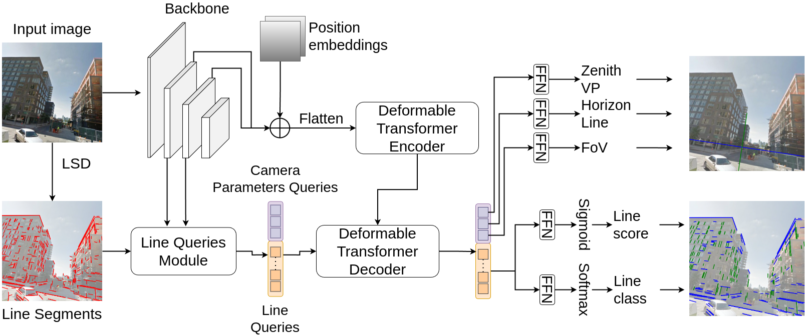

# SOFI
[](https://colab.research.google.com/drive/1_DQL0uT9i2nJHRlTXZrEHzkAwCbO6DRq#scrollTo=oCfbMY4W7PMU) [](TODO) 
 
This repository contains the official code and pretrained models for **SOFI** (multi-**S**cale def**O**rmable trans**F**ormer for camera calibrat**I**on with enhanced line queries)

Camera calibration consists on estimating the camera parameters such as the zenith vanishing point, and horizon line. In addition to this, estimating the camera parameters allows other tasks like 3D rendering, artificial reality effects and, object insertion in an image. Transformer-based model have provided promising results; however, they lack of cross-scale interaction. In this work, we introduce multi-**S**cale def**O**rmable trans**F**ormer for camera calibrat**I**on with enhanced line queries, SOFI. SOFI improves the line queries used in CTRL-C and MSCC by using both line content and line geometric features. Moreover, SOFI's line queries allows transformer models to adopt the multi-scale deformable attention mechanism to promote cross-scale interaction between the feature maps produced by the backbone. SOFI outperforms existing methods on the *Google Street View*, *Horizon Line in the Wild*, and *Holicity* datasets while keeping a competitive inference speed.



## Results & Checkpoints

### Google Street View Dataset (Training)
|Model| Up Dir (◦) | Pitch (◦) | Roll (◦) | FoV (◦) | AUC (%) | URL |
| --- | --- | --- | --- | --- | --- | --- |
**Official Implementation**
|CTRL-C | 1.80 | 1.58 | 0.66 | 3.59 | 87.29 | 
|MSCC| 1.72 | 1.50 | 0.62 | 3.21 |
**Ours** 
|CTRL-C | 1.71 | 1.52 | 0.57 | 3.38 | 87.16 | 
|MSCC| 1.75 | 1.56 | 0.58 | 3.04 | 87.63 |
|SOFI| 1.64 | 1.51 | 0.54 | 3.09 | 87.87 | [link](!https://www.dropbox.com/scl/fi/1dwdn9sepyyj818ri5ml9/sofi.pth?rlkey=zwldsnj0vk7tb8px4hid2xwf8&st=s7uq8s2n&dl=0)

### Holicity Dataset (Testing)
|Model| Up Dir (◦) | Pitch (◦) | Roll (◦) | FoV (◦) | AUC (%) |
| --- | --- | --- | --- | --- | --- |
**Ours** 
|CTRL-C | 2.66 | 2.26 | 1.09 | 3.38 | 72.31 | 
|MSCC| 2.28 | 1.87 | 1.08 | 1.08 | 77.43 |
|SOFI| 2.23 | 1.75 | 1.16 | 1.16 | 82.96 |

### Horizon Line in the Wild  Dataset (Testing)
|Model| AUC (%) |
| --- | --- |
**Ours** 
|CTRL-C | 46.37 | 
|MSCC| 47.28 |
|SOFI| 49.69 |


## Installation


1. Clone this repository.
   ```sh
   git clone https://github.com/SebastianJanampa/SOFI.git
   cd SOFI
   ```

2. Install Pytorch and torchvision

   Follow the instruction on https://pytorch.org/get-started/locally/.
   ```sh
   # an example:
   conda install -c pytorch pytorch torchvision
   ```

3. Install other needed packages
   ```sh
   pip install -r requirements.txt
   ```
      
4. Compiling CUDA operators
   ```sh
   cd models/dino/ops
   python setup.py build install
   # unit test (should see all checking is True)
   python test.py
   cd ../../..
   ```

## Dataset

   ```sh
   mkdir dataset data_csv
   ```
* Please download [Google Street View dataset](https://drive.google.com/file/d/1o_831g-3NDnhR94MEwDS2MFvAwpGmVXN/view?usp=share_link), [Horizon Line in the Wild (HLW)](https://mvrl.cse.wustl.edu/datasets/hlw/) datasets and organize them as following:
```
SOFI/
├── data/
│    ├── google_street_view_191210
│    ├── hlw
│    └── holicity
│    
└── data_csv/
     ├── gsv_train_20210313
     └── gsv_test_20210313
```

## RUN 

1. Training
```sh
bash scripts/train/model_name.sh 
```
We support training for SOFI, CTRL-C and MSCC

2. Testing
```sh
bash scripts/train/model_name.sh dataset
```
Supported datasets: gsv, hlw and holicity

3. Compute metrics
```sh
bash results.py --dataset dataset
```

## Citation
If you use this code for your research, please cite our paper:

```sh
@InProceedings{Janampa_BMVC2024,
    Title     = {{SOFI: Multi-Scale Deformable Transformer for Camera Calibration with Enhanced Line Queries}},
    Author    = {Sebastian Janampa Student and Marios Pattichis},    
    Booktitle = {35th British Machine Vision Conference 2025, {BMVC} 2025, Glasgow, UK, November 25-28, 2024},
    Year      = {2024},
}
   ```

